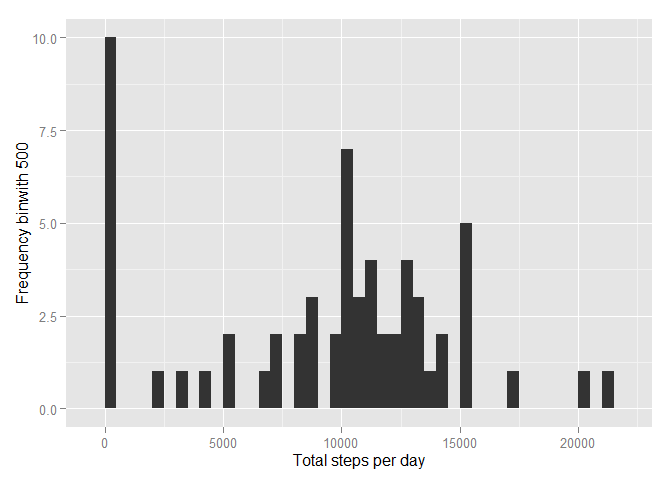
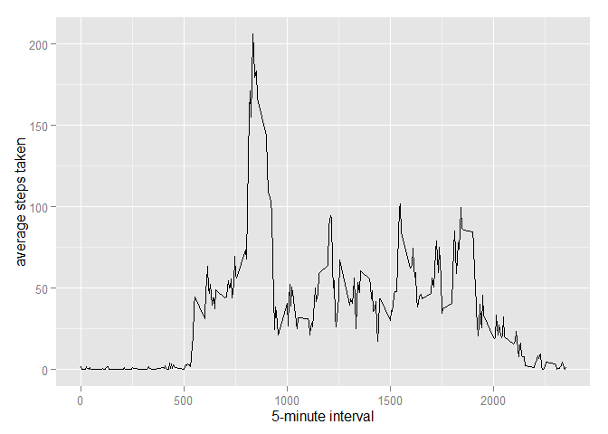
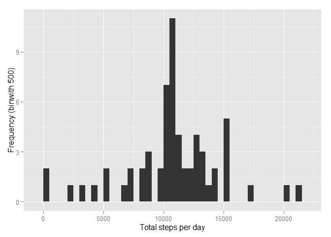
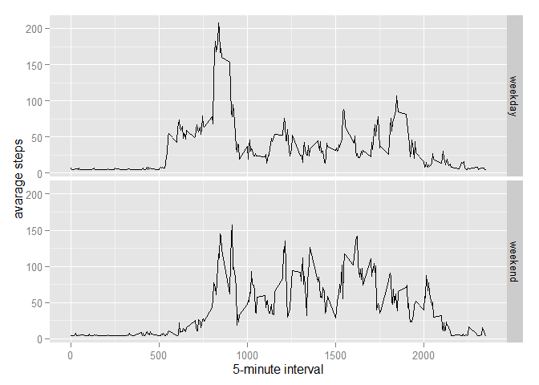

# Reproducible Research: Peer Assessment 1


## Loading and preprocessing the data
##### 1. Load the data (i.e. read.csv())

```r
library(ggplot2)
library(scales)
library(Hmisc)
```


```r
unzip('activity.zip')
data <- read.csv("activity.csv")
```

-----

## What is mean total number of steps taken per day?
We can calculate the meadian using:

```r
steps <- tapply(data$steps, data$date, sum, na.rm = T)
```

##### 1. Make a histogram of the total number of steps taken each day

```r
qplot(steps, xlab="Total steps per day", ylab="Frequency binwith 500", binwidth = 500)
```

 

##### 2. Calculate and report the mean and median total number of steps taken per day

```r
mean(steps, na.rm = T)
```

```
## [1] 9354.23
```

```r
median(steps, na.rm = T)
```

```
## [1] 10395
```

-----

## What is the average daily activity pattern?

```r
library(ggplot2)
avg <- aggregate(x = list(steps = data$steps), by = list(interval = data$interval), FUN = mean, na.rm = T)
```

##### 1. Make a time series plot

```r
ggplot(data = avg, aes(x = interval, y = steps)) +
    geom_line() + xlab("5-minute interval") + ylab("average steps taken")
```

 

##### 2. Which 5-minute interval, on average across all the days in the dataset, contains the maximum number of steps?

```r
avg[which.max(avg$steps),]
```

```
##     interval    steps
## 104      835 206.1698
```

```r
maxSteps <- which.max(avg$meanSteps)
```

* Most Steps at: 

## Imputing missing values
##### 1. Calculate and report the total number of missing values in the dataset 

```r
missing <- length(which(is.na(data$steps)))
```

* Number of missing values: 2304

All of the missing values are filled in with mean value for that 5-minute
interval.

##### 2&3. Create a new dataset that is equal to the original dataset but with the missing data filled in.

```r
dataMissing <- data
dataMissing$steps <- impute(data$steps, fun = mean)
```

##### 4. Make a histogram of the total number of steps taken each day 

```r
stepsMissing <- tapply(dataMissing$steps, dataMissing$date, sum)
qplot(stepsMissing, xlab = "Total steps per day", ylab = "Frequency (binwith 500)", binwidth = 500)
```

 

* Mean: 1.0766189\times 10^{4}
* Median:  1.0766189\times 10^{4}


##### 1. Create a new factor variable in the dataset with two levels - "weekday" and "weekend" indicating whether a given date is a weekday or weekend day.


```r
dataMissing$dateType <-  ifelse(as.POSIXlt(dataMissing$date)$wday %in% c(0,6), 'weekend', 'weekday')
```

##### 2. Make a panel plot containing a time series plot


```r
avgMissing <- aggregate(steps ~ interval + dateType, data = dataMissing, mean)
ggplot(avgMissing, aes(interval, steps)) + geom_line() + facet_grid(dateType ~ .) + xlab("5-minute interval") + ylab("avarage steps")
```

 
